# Testare unitară în C#

**T2 Testare unitară în C#**
* Utilizați un framework de testare unitară din C# pentru a testa funcționalitățile unei clase.
* Ilustrați strategiile de generare de teste prezentate la curs (partiționare în clase de echivalență, analiza valorilor de frontieră, acoperire la nivel de instrucțiune, decizie, condiție, circuite independente, analiză raport creat de generatorul de mutanți, teste suplimentare pentru a omorî 2 dintre mutanții neechivalenți rămași în viață) pe exemple proprii (create de echipă).

## Prezentare
S-a testat o componentă din aplicația Uniflow, și anume sistemul de gamificare care oferă utilizatorilor puncte XP în funcție de activitatea lor. S-a urmărit să se verifice dacă serviciul de gamificare calculează corect punctajul și dacă aplicația se comportă bine în situații diferite, inclusiv în cazuri limită.

Am ales clasa `GamificationService` (și în mod specific metoda `CalculateXPFromVotes`) din mai multe motive:
- complexitate ciclomatică ridicată
- condiții compuse cu multiple ramificări pentru calculul de XP pozitiv și negativ
- cascade de praguri (ex: 10, 25, 50, 100) potrivite pentru Boundary Value Analysis (BVA)
- logică matematică și de domeniu izolabilă unde rezultatul nu poate fi negativ (necesită verificare la limită)

## Structura clasei testate
Tabelul arată metodele relevante și complexitatea lor ciclomatică (estimată prin numărul de decizii/predicate + 1).

| Metoda | Complexitate Ciclomatică V(G) |
|--------|------------------------------|
| `CalculateXPFromVotes` | 14 |
| `AwardXPAsync` | 3 |
| `GetLeaderboardAsync` | 3 |
| `CalculateLevel` | 2 |

### 2.1. Matricea de trasabilitate
Matricea de mai jos leagă clasa de test de metodele acoperite și strategiile aplicate.

| Metoda testată (`GamificationService`) | Clasa de test | Strategie aplicată |
|---|---|---|
| `CalculateXPFromVotes` | `GamificationTests` / `TestRunner` | EP, BVA, MC/DC, V(G) |
| `AwardXPAsync` | `GamificationTests` | Statement Coverage, Mutation |
| `GetLeaderboardAsync` | `GamificationTests` | Statement, BVA, Mutation |
| `CalculateLevel` | `GamificationTests` | Mutation Testing |

- EP: Equivalence Partitioning
- BVA: Boundary Value Analysis
- MC/DC: Modified Condition/Decision Coverage
- V(G): Complexitate Ciclomatică (formula McCabe)

### 2.2. Arhitectura suitei de testare
Fișierele de testare sunt grupate în proiectul `Uniflow.Tests`. Fișierul principal este `GamificationTests.cs`. De asemenea, a fost conceput un runner de consolă (`TestRunner`) pentru testarea algoritmică izolat de baza de date.

- **Testele Black Box** (EP și BVA) validează comportamentul prin specificație. Au fost definite clase de echivalență și praguri pentru acordarea de XP bazate pe `upvotes` și penalizări pentru `downvotes`.
- **Testele White Box** (Statement, Decision, Condition) verifică fiecare bloc decizional din `CalculateXPFromVotes`.
- **Testele Basis Path** (CFG) parcurg toate căile liniar independente descrise de graful de control.
- **Testele de Mutation** (Stryker) verifică robustețea testelor, urmărind să omoare mutanții generați (ex: `>=` în `>`).


### Sumar execuție și Analiza acoperirii
- Total teste executate: 46 (în TestRunner) + 60 teste xUnit (pentru Gamification)
- Teste trecute: 100%
- Mutation Score (Stryker): ~76% (110 din 145 mutanți acoperiți omorâți)

**Justificarea procentelor sub 100%:**
Mutanții supraviețuitori (35 la număr) sunt în mare parte echivalenți (de exemplu modificarea unei condiții `if (upvotes <= 10)` în `< 10` nu produce un defect vizibil deoarece la calculul final rezultatul este acoperit de următoarea treaptă de bonusare, rezultând în același scor matematic). Doi mutanți inițial neechivalenți au fost rezolvați cu teste suplimentare (vezi secțiunea de Mutation Testing).

#### Output Execuție xUnit
**Comandă rulată:** `dotnet test Uniflow.Tests --filter GamificationTests`
```text
Starting test execution, please wait...
A total of 1 test files matched the specified pattern.
[xUnit.net 00:00:00.28]     CalculateXPFromVotes - Statement Coverage [SKIP]
  Skipped CalculateXPFromVotes - Statement Coverage [1 ms]

Passed!  - Failed:     0, Passed:    59, Skipped:     1, Total:    60, Duration: 1 s - Uniflow.Tests.dll (net8.0)
```

#### Output Execuție TestRunner (Consolă)
**Comenzi rulate:**
```bash
cd TestRunner
dotnet run
```
```text
═══════════════════════════════════════════════════════
  Teste CalculateXPFromVotes – GamificationService
═══════════════════════════════════════════════════════

┌─ EP: Upvotes ─────────────────────────────────
  ✅ PASS | Input invalid (negativ) → 0                   | (  -5,  0) → 0
  ✅ PASS | Zero upvotes                                  | (   0,  0) → 0
  ✅ PASS | Tier 1 (5 upvotes)                            | (   5,  0) → 50
  ✅ PASS | Tier 1 maxim (10 upvotes + bonus 25)          | (  10,  0) → 125
  ✅ PASS | Tier 2 (15 upvotes)                           | (  15,  0) → 165
  ✅ PASS | Tier 3 (30 upvotes)                           | (  30,  0) → 320
  ✅ PASS | Tier 4 (60 upvotes)                           | (  60,  0) → 550
  ✅ PASS | Tier 5 (110 upvotes)                          | ( 110,  0) → 890

┌─ EP: Downvotes ─────────────────────────────────
  ✅ PASS | Downvotes Tier 1 (3 downvotes)                | (  10,  3) → 119
  ✅ PASS | Downvotes Tier 2 (10 downvotes)               | (  10, 10) → 100
  ✅ PASS | Downvotes Tier 3 (20 downvotes)               | (  10, 20) → 80
  ✅ PASS | Input invalid downvotes (negativ) → fara pen  | (  10, -3) → 131

┌─ BVA: Frontiere Upvotes ─────────────────────────────────
  ✅ PASS | Sub pragul 10 (9 upvotes)                     | (   9,  0) → 90
  ✅ PASS | LA pragul 10 + bonus                          | (  10,  0) → 125
  ✅ PASS | Peste pragul 10 (11 upvotes)                  | (  11,  0) → 133
  ✅ PASS | Sub pragul 25 (24 upvotes)                    | (  24,  0) → 237
  ✅ PASS | LA pragul 25 + bonus                          | (  25,  0) → 295
  ✅ PASS | Peste pragul 25 (26 upvotes)                  | (  26,  0) → 300
  ✅ PASS | Sub pragul 50 (49 upvotes)                    | (  49,  0) → 415
  ✅ PASS | LA pragul 50 + bonus                          | (  50,  0) → 520
  ✅ PASS | Peste pragul 50 (51 upvotes)                  | (  51,  0) → 523
  ✅ PASS | Sub pragul 100 (99 upvotes)                   | (  99,  0) → 667
  ✅ PASS | LA pragul 100 + bonus                         | ( 100,  0) → 870
  ✅ PASS | Peste pragul 100 (101 upvotes)                | ( 101,  0) → 872

┌─ BVA: Frontiere Downvotes ─────────────────────────────────
  ✅ PASS | Sub pragul 5 downvotes (4)                    | (  10,  4) → 117
  ✅ PASS | LA pragul 5 downvotes                         | (  10,  5) → 115
  ✅ PASS | Peste pragul 5 (6 downvotes)                  | (  10,  6) → 112
  ✅ PASS | Sub pragul 15 downvotes (14)                  | (  10, 14) → 88
  ✅ PASS | LA pragul 15 downvotes                        | (  10, 15) → 85
  ✅ PASS | Peste pragul 15 (16 downvotes)                | (  10, 16) → 84

┌─ Protectie: XP negativ → return 0 ─────────────────────────────────
  ✅ PASS | Penalizare masiva, XP < 0 → 0                 | (   2, 50) → 0
  ✅ PASS | Zero upvotes, penalizare → 0                  | (   0,100) → 0

┌─ Suplimentar: Verificare milestones individuale ─────────────────────────────────
  ✅ PASS | Milestone 10 – doar bonusul de 25 activ       | (  10,  0) → 125
  ✅ PASS | Milestone 25 – bonusuri de 25+50 active       | (  25,  0) → 295
  ✅ PASS | Milestone 50 – bonusuri de 25+50+100          | (  50,  0) → 520
  ✅ PASS | Milestone 100 – toate bonusurile active       | ( 100,  0) → 870
  ✅ PASS | Sub orice milestone – 0 bonusuri              | (   9,  0) → 90

┌─ Suplimentar: Frontiere simultane upvotes + downvotes ─────────────────────────────────
  ✅ PASS | Ambele la prag: up=10, down=5                 | (  10,  5) → 115
  ✅ PASS | Ambele la prag: up=25, down=15                | (  25, 15) → 255
  ✅ PASS | Ambele la prag: up=100, down=15               | ( 100, 15) → 830
  ✅ PASS | Extreme pozitiv: up=200, down=50              | ( 200, 50) → 995

┌─ Suplimentar: Valori minime (un singur vot) ─────────────────────────────────
  ✅ PASS | Exact 1 upvote → 10 XP                        | (   1,  0) → 10
  ✅ PASS | Exact 1 downvote → -2 XP → 0                  | (   0,  1) → 0
  ✅ PASS | 1 upvote + 1 downvote → 10-2 = 8              | (   1,  1) → 8

┌─ Suplimentar: Penalizare Tier 3 verificata la valori mari ─────────────────────────────────
  ✅ PASS | 50 downvotes cu 10 upvotes → 50 XP            | (  10, 50) → 50
  ✅ PASS | 100 downvotes cu 10 upvotes → 0 XP            | (  10,100) → 0

═══════════════════════════════════════════════════════
  Rezultat: 46 PASSED  |  0 FAILED  |  46 total
═══════════════════════════════════════════════════════
```

---

### 3.1. Equivalence Partitioning (EP)
Pentru testare, datele de intrare au fost împărțite în categorii similare (clase de echivalență).

**Clase individuale la upvotes (U):**
| Clasă | Interval | Reprezentant |
|---|---|---|
| U_1 (invalid) | upvotes < 0 | -5 |
| U_2 | upvotes = 0 | 0 |
| U_3 | 1 <= upvotes <= 10 | 5 |
| U_4 | 11 <= upvotes <= 25 | 15 |
| U_5 | 26 <= upvotes <= 50 | 30 |
| U_6 | 51 <= upvotes <= 100 | 60 |
| U_7 | upvotes > 100 | 110 |

**Clase individuale la downvotes (D):**
| Clasă | Interval | Reprezentant |
|---|---|---|
| D_1 (invalid) | downvotes < 0 | -3 |
| D_2 | downvotes = 0 | 0 |
| D_3 | 1 <= downvotes <= 5 | 3 |
| D_4 | 6 <= downvotes <= 15 | 10 |
| D_5 | downvotes > 15 | 20 |

**Clase globale**
Clasele globale se obțin prin combinarea claselor individuale:

| Clasă globală | Upvotes (U) | Downvotes (D) | Reprezentant |
|---|---|---|---|
| C_11 | U_2 (0) | D_2 (0) | (0, 0) |
| C_32 | U_3 (1–10) | D_2 (0) | (5, 0) |
| C_33 | U_3 (1–10) | D_3 (1–5) | (10, 3) |
| C_34 | U_3 (1–10) | D_4 (6–15) | (10, 10) |
| C_35 | U_3 (1–10) | D_5 (>15) | (10, 20) |
| C_42 | U_4 (11–25) | D_2 (0) | (15, 0) |
| C_52 | U_5 (26–50) | D_2 (0) | (30, 0) |
| C_62 | U_6 (51–100) | D_2 (0) | (60, 0) |
| C_72 | U_7 (>100) | D_2 (0) | (110, 0) |
| C_U1 | U_1 (invalid) | — | (-5, 0) |
| C_D1 | — | D_1 (invalid) | (10, -3) |

Pentru fiecare categorie au fost alese valori reprezentative și s-a verificat dacă metoda returnează rezultatul corect. Toate aceste teste se regăsesc și în suita xUnit (`GamificationTests.cs`).

---

### 3.2. Analiza valorilor de frontieră (BVA)
Au fost testate valorile aflate exact la limitele intervalelor pentru a evita erorile de tip off-by-one.

**Frontierele testate pentru upvotes (U):**
* U_2/U_3 (prag 0): 0, 1
* U_3/U_4 (prag 10): 9, 10, 11
* U_4/U_5 (prag 25): 24, 25, 26
* U_5/U_6 (prag 50): 49, 50, 51
* U_6/U_7 (prag 100): 99, 100, 101

**Frontierele testate pentru downvotes (D):**
* D_3/D_4 (prag 5): 4, 5, 6
* D_4/D_5 (prag 15): 14, 15, 16

Pentru a aprofunda analiza (BVA pe clase globale), au fost testate inclusiv frontiere simultane, adică punctele în care ambele variabile iau valori limită în același timp:

| Clasă globală | upvotes | downvotes | XP așteptat |
|---|---|---|---|
| C_33 | 10 | 5 | 115 |
| C_34 | 10 | 15 | 85 |
| C_42 | 25 | 5 | 285 |
| C_42 | 25 | 15 | 255 |
| C_52 | 50 | 5 | 510 |
| C_62 | 100 | 15 | 830 |

---

### 3.3. Acoperirea Testelor (Coverage)

**Acoperirea la nivel de instrucțiune (Statement Coverage)**
Verifică dacă fiecare bloc important din metodă a fost executat cel puțin o dată.
* Primul scenariu a fost un caz de tip „Top Contributor”, cu: `upvotes = 150`. Acest test trece prin toate nivelurile de upvotes și activează toate bonusurile.
* Al doilea scenariu a fost un caz de tip „Spammer”, cu: `upvotes = 0`, `downvotes = 100`. Acest test verifică penalizările mari și cazul în care XP-ul final este plafonat la 0.

**Acoperirea la nivel de decizie (Decision Coverage)**
Verifică dacă fiecare ramură logică a fost parcursă. Pentru fiecare condiție din cod a existat:
- un test care intră pe ramura „Da”
- un test care intră pe ramura „Nu”
Un exemplu important este verificarea: `if(totalXP < 0)`. S-a testat cu rezultate negative (plafonat la 0) și pozitive.

**Acoperirea la nivel de condiție (Condition Coverage)**
În această metodă condițiile sunt simple și conțin un singur predicat (o singură verificare), de exemplu: `upvotes <= 10`. Din acest motiv, odată obținută acoperirea la nivel de decizie, a fost acoperită automat și partea de condiții.

---

### 3.4. Circuite independente și complexitate ciclomatică
A fost realizat graful de control al metodei (CFG - Control Flow Graph) pentru metoda de calcul, evidențiind căile independente care trebuie testate.

```mermaid
graph TD
    Start((Start)) --> N1["1-3: totalXP=0, tier1Count, totalXP+="]

    N1 --> D2{"4: upvotes &lt;= 10?"}
    D2 -- Da --> N12["17-19: totalPenalty=0, tier1Down, penalty+="]
    D2 -- Nu --> N3["5-6: tier2Count, totalXP+="]

    N3 --> D4{"7: upvotes &lt;= 25?"}
    D4 -- Da --> N12
    D4 -- Nu --> N5["8-9: tier3Count, totalXP+="]

    N5 --> D6{"10: upvotes &lt;= 50?"}
    D6 -- Da --> N12
    D6 -- Nu --> N7["11-12: tier4Count, totalXP+="]

    N7 --> D8{"13: upvotes &lt;= 100?"}
    D8 -- Da --> N12
    D8 -- Nu --> N9["14-15: tier5Count, totalXP+="]
    N9 --> N12

    N12 --> D13{"20: downvotes &lt;= 5?"}
    D13 -- Da --> N18["27: bonuses=0"]
    D13 -- Nu --> N14["21-22: tier2Down, penalty+="]

    N14 --> D15{"23: downvotes &lt;= 15?"}
    D15 -- Da --> N18
    D15 -- Nu --> N16["24-25: tier3Down, penalty+="]
    N16 --> N18

    N18 --> D19{"28: upvotes &gt;= 100?"}
    D19 -- Da --> N20["28: bonuses+=200"] --> D21{"29: upvotes &gt;= 50?"}
    D19 -- Nu --> D21

    D21 -- Da --> N22["29: bonuses+=100"] --> D23{"30: upvotes &gt;= 25?"}
    D21 -- Nu --> D23

    D23 -- Da --> N24["30: bonuses+=50"] --> D25{"31: upvotes &gt;= 10?"}
    D23 -- Nu --> D25

    D25 -- Da --> N26["31: bonuses+=25"] --> N27["33: totalXP=up-pen+mil"]
    D25 -- Nu --> N27

    N27 --> D28{"34: totalXP &lt; 0?"}
    D28 -- Da --> N29["34: return 0"]
    D28 -- Nu --> N30["34: return totalXP"]

    N29 --> Stop((Stop))
    N30 --> Stop
```



---

### 3.5. Testarea bazată pe mutanți (Mutation Testing)
A fost rulat instrumentul **Stryker.NET** pentru a evalua calitatea testelor prin injectarea de mutanți în codul sursă.

**Analiza raportului Stryker (`GamificationService`)**
* **Total mutanți:** 196
* **Mutanți omorâți (Killed):** 110
* **Mutanți supraviețuitori (Survived):** 35
* **Mutanți fără acoperire (No coverage):** 19
* **Mutanți ignorați (Ignored):** 30
* **Scor de mutație (Mutation Score - Of covered):** 76.03%

**Analiza mutanților echivalenți**
O parte din cei 35 de mutanți rămași sunt **echivalenți**:
* **Equality Mutator:** `if (upvotes <= 10)` a devenit `< 10`. Pentru `upvotes = 10`, codul original dă 100 XP. Mutantul sare linia, dar următoarea condiție adaugă `0` la XP și se oprește la pragul de 25, returnând tot 100 XP.
* **Arithmetic Mutator:** Înmulțirea penalizării de tier 3 (`X * 1`) a fost schimbată în împărțire (`X / 1`). Deoarece constanta este `1`, rezultatul matematic este identic.

**Teste suplimentare (Killing Mutants)**
Pentru a "omorî" 2 dintre mutanții neechivalenți rămași în viață, s-au adăugat teste specifice în `GamificationTests.cs`:
* **Logical Mutator:** Condiția `(FirstName == "" && LastName == "")` a devenit `||`. S-a creat testul `Kill_Mutant_LogicalAnd_NumeIncomplet_FolosesteCeAvem` cu un utilizator care are doar prenume. Testul pică dacă se folosește un `||` în loc de `&&`.
* **Equality Mutator:** Verificarea de nivel `if (newLevel > oldLevel)` a devenit `>=`. S-a scris testul `Kill_Mutant_LevelUpCondition_FaraCrestereNivel_NuDaVoucher` care acordă XP fără a crește nivelul și confirmă că nu se alocă vouchere eronate.

---

### 3.6. Implementare de Referință (Console Test Runner)
Pe lângă testele xUnit integrate în proiect, a fost scris și un runner de teste standalone (consolă) care înglobează logica izolată pentru a rula extrem de rapid sute de cazuri de partiționare și analiză BVA. Acest runner execută scripturile de testare detaliate și returnează un log în consolă cu rezultatele fiecărui asert, făcând parte integrantă din procesul de validare a tabelelor de echivalențe.

---
## 4. Analiza Asistenților AI în Generarea Testelor (Comparative Study)

În scopul de a determina eficiența generatoarelor de cod bazate pe inteligență artificială (precum ChatGPT sau Copilot) în contextul unor cerințe academice stricte, am solicitat generarea automată a suitei de teste unitare. Ulterior, am pus în contrast rezultatul obținut de la AI cu suita de teste construită manual de echipa noastră.

### Proiectarea Prompt-ului (AI Prompt Design)
Am furnizat AI-ului următorul prompt, însoțit de codul sursă complet pentru `GamificationService`:

> Ai rolul unui tester software cu experiență. Sarcina ta este să generezi un fișier de teste unitare folosind framework-ul xUnit pentru metoda `CalculateXPFromVotes` din clasa atașată.
> 
> Este obligatoriu să aplici și să demonstrezi prin cod următoarele tehnici teoretice de testare:
> 1. Equivalence Partitioning (Partiționarea claselor de echivalență)
> 2. Boundary Value Analysis (Analiza valorilor de limită/frontieră)
> 3. Statement Coverage (Acoperire la nivel de instrucțiune)
> 4. Branch Coverage (Acoperire decizională)
> 5. Condition Coverage (Acoperirea condițiilor)
> 6. Basis Path Testing (Testarea circuitelor independente)
> 
> Te rog să scrii codul organizat, grupând testele pe categorii corespunzătoare acestor 6 tehnici. Folosește atributele xUnit (`[Fact]` sau `[Theory]`) cu parametrul `DisplayName` setat astfel încât să indice clar ce strategie și ce metodă testezi.
> Adaugă comentarii detaliate pentru fiecare test în care să justifici de ce ai ales acele valori (ex: ce graniță matematică testezi sau pe ce ramură intri).
> 
> Codul sursă al clasei `GamificationService` este următorul: [Cod Atașat]

### Output-ul AI și Analiza Comparativă
Asistentul AI a reușit să respecte șablonul structural cerut și a generat un fișier xUnit executabil. Am rulat acest cod izolat în clasa `AIGamificationTests.cs`.

**Ce a funcționat bine (Avantajele AI-ului):**
- **Recunoașterea claselor de echivalență de bază:** A selectat corect intervale generale de testare (cum ar fi 0, un număr negativ, sau o valoare foarte mare).
- **Viteză și Coverage:** A produs foarte rapid un Statement Coverage decent trecând prin "happy path"-ul logicii.
- **Sintaxă și organizare:** Structura și adnotările xUnit au fost implementate impecabil conform specificației.

**Limitări și greșeli critice (Față de munca manuală):**
- **Eșecul la aserțiuni complexe (Matematică greșită):** La scenariile "Statement Coverage", AI-ul a calculat mental greșit scorul XP așteptat pentru utilizatorii cu valori mari de upvotes/downvotes, ceea ce a dus la teste care pică ("failed") imediat la execuție.
- **Scăpări majore la valorile de frontieră (BVA):** Inteligența artificială nu a reușit să testeze corect pragurile limită în combinație. A testat o singură variabilă la graniță, lăsând restul variabilelor în zone sigure, ratând astfel erorile de tip "off-by-one" la intersecții (de exemplu, când `upvotes` și `downvotes` sunt simultan pe prag).
- **Scor de Mutație slab (Mutation Testing):** AI-ul s-a bazat pe verificări largi, lăsând mulți mutanți în viață. Testele generate nu validează destul de fin operatorii logici (`>` vs `>=`), motiv pentru care în suita noastră manuală am fost nevoiți să introducem teste țintite pentru a omorî mutanții supraviețuitori.
- **Ignorarea complexității ciclomatice (Basis Path):** Deși V(G) este 14, AI-ul a tratat acoperirea circuitelor independente foarte superficial, propunând doar 3-4 scenarii subțiri. Omiterea circuitelor de penalizare combinate a lăsat mari porțiuni netestate pe calea negativă.

### Execuția Suitei Generate de AI
Pentru a valida deficiențele observate, am izolat suita generată de AI într-un fișier separat (`AIGamificationTests.cs`) și l-am rulat din consolă pentru a demonstra eșecul aserțiunilor:

```bash
dotnet test --filter AIGamificationTests
```

**Rezultatul rulării (Terminal Output):**
```text
Starting test execution, please wait...
A total of 1 test files matched the specified pattern.
[xUnit.net 00:00:00.39]     CalculateXPFromVotes - Statement Coverage [FAIL]
  Failed CalculateXPFromVotes - Statement Coverage [4 ms]
  Error Message:
   Assert.Equal() Failure: Values differ
Expected: 890
Actual:   925
  Stack Trace:
     at Uniflow.Tests.AIGamificationTests.CalculateXPFromVotes_StatementCoverage()

Failed!  - Failed:     1, Passed:     5, Skipped:     0, Total:     6, Duration: 292 ms - Uniflow.Tests.dll (net8.0)
```
Eroarea confirmă incapacitatea AI-ului de a anticipa corect calculele matematice complexe cumulate (bonusuri suprapuse), demonstrând necesitatea scrierii și validării umane pentru logica de domeniu avansată.
